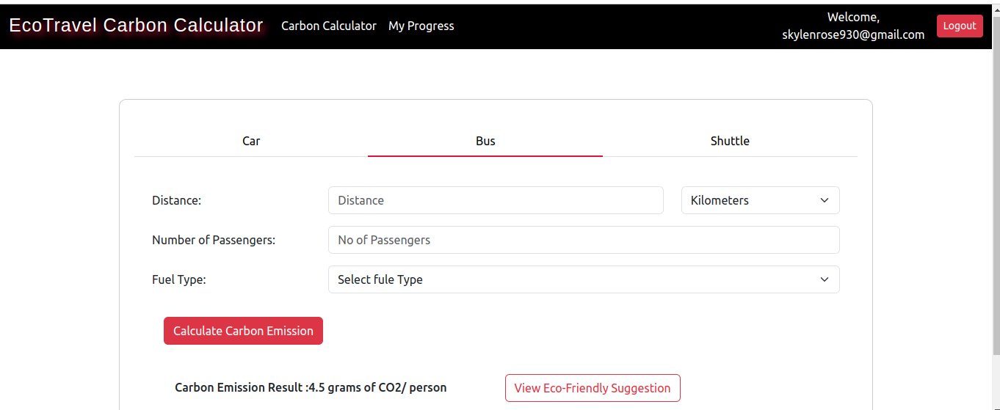

# Cloud and DevOps Bootcamp Completion

🚀 **Welcome to my Cloud and DevOps Bootcamp Journey!** 🚀

I am thrilled to announce that I have successfully completed the Cloud and DevOps Bootcamp at [xgrid.co](https://www.xgrid.co/). This journey has been both challenging and rewarding, and I would like to express my sincere appreciation to xgrid.co for providing me with the knowledge and skills needed to excel in the cloud and DevOps domain.

## 🛠️ Skills and Knowledge Gained

Throughout the bootcamp, I gained proficiency in various AWS services and DevOps practices. Here is a summary of some of the key areas I am well-versed in:

### 🌟 AWS Services

1. **Amazon EC2 (Elastic Compute Cloud):** I have experience in provisioning and managing virtual servers in the cloud.

2. **Amazon ECS (Elastic Container Service):** I have learned to orchestrate containerized applications efficiently.

3. **AWS Lambda:** I can design and deploy serverless functions for various use cases, which offers great benefits in terms of cost optimization and scalability.

4. **Amazon Cognito:** I have expertise in implementing user authentication and authorization in my applications.

5. **Amazon Route 53:** I can configure DNS settings, including CNAME records and SSL/TLS certificates for secure communication.

6. **Load Balancers and Listeners:** I have experience setting up load balancers and configuring listeners for distributing traffic across multiple instances.

7. **Blue-Green Deployment:** I understand the concept of blue-green deployments, which allows for seamless updates and rollback strategies.

For a detailed list of all the sprint tasks I covered during my bootcamp at xgrid.co, please refer to my [GitHub repository](https://github.com/SanaRahman/AWS-Terraform-Series).

### 💼 AWS Services Used for My Serverless Website

I have successfully deployed a serverless website on Amazon Web Services (AWS) that calculates carbon emissions based on user input data. Here's how I leveraged various AWS services for this project:

1. **Amazon ECS Fargate for Frontend:** I utilized Amazon ECS Fargate to host the frontend of my application. This container orchestration service allowed me to deploy and scale my frontend easily.
   Benefits of using ECS Fargate:
   - Efficient resource utilization
   - Automatic scaling
   - Isolation between containers

2. **AWS Lambda for Backend Deployment:** I employed AWS Lambda functions for the backend of my application. This serverless approach offers several advantages, including cost optimization and automatic scaling based on demand.
   Benefits of using Lambda:
   - Cost optimization (pay only for actual usage)
   - Automatic scaling
   - No server management required

3. **Amazon RDS Cluster for Serverless:** I used an Amazon RDS (Relational Database Service) cluster to manage my serverless database. This choice provides high availability and scalability for data storage.
   Benefits of using Amazon RDS:
   - High availability and automatic failover
   - Scalability
   - Managed database service

4. **Load Balancer:** I integrated a load balancer to distribute incoming traffic evenly across my application instances, ensuring high availability and improved performance.
   Benefits of using a load balancer:
   - High availability
   - Scalability
   - Load distribution

5. **Amazon Route 53 for Domain Registration:** I registered my domain using Amazon Route 53, which simplifies DNS management and provides reliable domain services.

## 📂 Project Structure

My project is organized into three main folders:

1. **Frontend:** This folder contains information about the React application, including the user interface and client-side logic.

2. **Backend:** Here, you'll find the Python backend code, which was later transformed into separate Lambda functions to power the serverless backend of the application.

3. **Terraform:** The Terraform files in this folder include all the infrastructure-as-code (IAC) configurations and services used to deploy and manage my AWS resources.

## 🖼️ Images

I'm excited to continue applying my newfound knowledge and skills in the cloud and DevOps field, and I'm grateful to xgrid.co for their excellent guidance throughout this journey.

