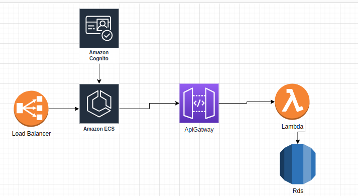

# EcoTravel Carbon Calculator Deployment with Terraform

This Terraform project automates the deployment of the EcoTravel Carbon Calculator
 application on Amazon Web Services (AWS). The application uses AWS services like Cognito, RDS (Aurora), ECS Fargate, Lambda with API Gateway, Application Load Balancers, and Route 53 for domain registration.

## Overview

The EcoTravel Carbon Calculator
 is a web application that allows users to calculate their carbon emissions for different travel modes and explore eco-friendly alternatives. The project leverages various AWS services to provide a secure and scalable solution.

### AWS Services Used

- **AWS Cognito**: Manages user authentication and authorization, allowing personalized experiences for users.

- **RDS (Aurora)**: Stores user data and application data, ensuring data durability and scalability.

- **ECS Fargate**: Deploys the frontend application in containers, ensuring scalability and resource isolation.

- **Lambda with API Gateway**: Provides backend functions for the application, including calculation logic and data retrieval.

- **Application Load Balancers**: Distribute incoming traffic across ECS Fargate instances for high availability.

- **Route 53**: Registers and manages the application's domain name for easy access.

## Prerequisites

Before running the Terraform scripts, ensure that you have:

- [Terraform](https://www.terraform.io/) installed on your local machine.
- AWS CLI configured with the necessary IAM permissions.
- An AWS account where resources will be provisioned.

## Usage

1. Clone this repository to your local machine:

   ```shell
   git clone https://github.com/SanaRahman/Aws-project.git
   ```

2. Navigate to the project directory:

   ```shell
   cd project-terraform
   ```

3. Initialize the Terraform working directory:

   ```shell
   terraform init
   ```

4. Review and customize the `main.tf` file to match your specific configuration needs.

6. Deploy the infrastructure using Terraform:

   ```shell
   terraform apply
   ```

7. Once the deployment is complete, Terraform will output the URL where the EcoTravel Carbon Calculator
 application can be accessed.

## Cleanup

To destroy the provisioned infrastructure and release AWS resources, run the following Terraform command:

```shell
terraform destroy
```
## Architecture Diagram



**Note**: Be cautious when using `terraform destroy` as it will remove all resources created by Terraform.

